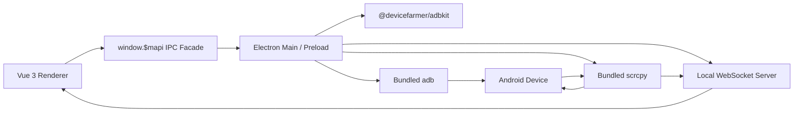

# LinkAndroid 项目调研报告

调研对象：[modstart-lib/linkandroid](https://github.com/modstart-lib/linkandroid)

调研日期：2026-05-08

## 1. 项目概览

LinkAndroid 是一个 Android 与 PC 连接管理工具，项目描述为 “Link Android and PC easily! 全能手机连接助手”。它面向普通桌面用户，提供 Android 设备连接、投屏、截屏、录屏、文件管理、应用管理、命令行和无线调试配对等能力。

与 QtScrcpy 的 Qt/C++ 自研客户端路线不同，LinkAndroid 更接近 DroidDock 当前方向：使用桌面壳应用管理 ADB 和 scrcpy，将复杂命令行流程包装成图形化体验。它没有重写 scrcpy 的视频解码和渲染链路，而是通过 Electron 主/渲染进程启动内置的 `adb` 和 `scrcpy` 二进制文件。

截至本次调研：

- 仓库地址：[modstart-lib/linkandroid](https://github.com/modstart-lib/linkandroid)
- 协议：Apache-2.0
- 默认分支：`main`
- 主要技术栈：TypeScript、Vue 3、Electron、Vite
- GitHub 当前规模：约 2k stars、180+ forks、20+ open issues
- 最新正式 release：`v1.0.3`，发布时间 2025-12-24
- 当前源码 `package.json` 版本为 `1.1.0`，changelog 中已有 `v1.1.0 Enhanced Wireless Pairing & Side Toolbar` 内容，说明源码主干已领先于最新正式 release

## 2. 技术架构路线

### 2.1 总体架构

LinkAndroid 使用 Electron + Vue 的典型桌面架构：



项目目录上主要分为：

- `src/`：Vue 前端、设备页、设置页、文件管理、应用管理、命令行、状态存储。
- `electron/main/`：Electron 主进程入口、窗口生命周期。
- `electron/mapi/`：主进程和渲染进程之间的能力封装，包含 ADB、scrcpy、文件、日志、配置、WebSocket 服务等。
- `electron/resources/extra/`：打包时放置平台相关附加资源，包括 scrcpy、adb、ffmpeg、ffprobe 等。
- `scripts/init.sh`：从 `modstart-lib/share-binary` 拉取各平台二进制依赖并复制到 `electron/resources/extra/<platform>-<arch>/`。

这个架构路线的核心判断是：LinkAndroid 把投屏底层能力交给 scrcpy，把设备管理能力交给 adbkit 和 adb 命令，把产品体验放在 Electron/Vue 层。

### 2.2 ADB 能力封装

LinkAndroid 同时使用两种 ADB 调用方式：

1. 使用 `@devicefarmer/adbkit` 获取设备列表、watch 设备变化、连接/断开网络设备、文件 push/pull、安装/卸载应用、读取目录、执行 shell。
2. 直接启动内置 `adb` 二进制执行 `adb pair`、`adb connect`、`adb shell screenrecord` 等命令。

核心封装在 `electron/mapi/adb/render.ts` 和 `electron/mapi/adb/main.ts`。其中：

- `devices()` 使用 adbkit 的 `listDevicesWithPaths()`。
- `watch()` 使用 adbkit 的 `trackDevices()` 监听设备插拔。
- `connect()` / `disconnect()` 使用 adbkit 网络连接接口。
- `tcpip()` / `usb()` 支持传统 USB/Wi-Fi 切换。
- `fileList()` / `filePush()` / `filePull()` / `fileDelete()` 封装文件管理。
- `install()` / `uninstall()` / `listApps()` 支持应用管理。
- `pair()` 和 `scannerConnect()` 处理 Android 11+ 无线调试配对。

这条路线比纯命令行拼接更产品化：简单命令可用 adbkit，复杂或新特性仍可落回内置 adb 进程。

### 2.3 scrcpy 启动路线

scrcpy 封装在 `electron/mapi/scrcpy/render.ts`。它通过 `extraResolveBin("scrcpy/scrcpy")` 找到平台内置 scrcpy，并设置以下环境变量：

- `ADB`：指向内置 adb。
- `SCRCPY_FONT_PATH`：指向内置字体。
- `SCRCPY_ICON_ROOT_PATH`：指向 scrcpy 图标目录。
- `SCRCPY_SERVER_PATH`：指向内置 `scrcpy-server`。

投屏启动时，前端设备 store 组装参数：

- `--serial <deviceId>`
- `--window-title <deviceName>`
- `--stay-awake`
- `--always-on-top`
- `--no-audio`
- `--video-bit-rate <value>`
- `--max-fps <value>`
- `--turn-screen-off`
- 用户自定义 `scrcpyArgs`

LinkAndroid 没有自己接管 scrcpy 的视频 socket 和解码渲染，而是直接启动 scrcpy 进程。这使其维护成本明显低于 QtScrcpy。

### 2.4 LinkAndroid 定制 scrcpy 扩展

源码中有一组非常关键的自定义参数：

- `--linkandroid-server <wsUrl>`
- `--linkandroid-preview-interval 1000`
- `--linkandroid-preview-ratio 30`
- `--linkandroid-panel-show`
- `--linkandroid-skip-taskbar`
- `--no-video-playback`
- `--no-audio-playback`

这些参数不是官方 scrcpy 标准参数，说明 LinkAndroid 依赖一份定制版 scrcpy。它通过 WebSocket 与 Electron 主进程通信，实现设备预览、投屏侧边栏、面板按钮、随动模式等产品能力。

这是一条折中路线：不重写 scrcpy 客户端，但维护一个改造过的 scrcpy 二进制。它比完全自研轻，但仍比直接使用官方 scrcpy 多一层长期维护成本。

### 2.5 本地 WebSocket 服务

`electron/mapi/serve/main.ts` 启动本地 WebSocket server，默认从 `10667` 开始寻找可用端口。它承担三类通信角色：

- `Render`：Vue 渲染进程，接收设备连接、断开、预览图、面板按钮事件。
- `DeviceManage`：后台设备管理 scrcpy 进程，用于预览、状态同步、接收被转发的控制事件。
- `DeviceMirror`：投屏窗口 scrcpy 进程，用于接收面板配置、置顶、退出等命令，并把操作事件传回 Electron。

这种设计使 LinkAndroid 能在普通 scrcpy 窗口外加一层产品控制面：

- 主窗口设备卡片显示实时预览图。
- 投屏窗口显示侧边按钮。
- 点击投屏窗口按钮后，Electron 主进程转成 ADB input 或 WebSocket 控制事件。
- 随动模式下，一个设备的触摸、按键、滚动事件可以广播到其他设备。

### 2.6 无线配对路线

LinkAndroid 对 Android 11+ 无线调试支持做得比较完整，包含两条路径：

#### 手动配对码

用户输入：

- IP 地址。
- 连接端口。
- 配对端口。
- 配对码。

程序先执行：

```shell
adb pair <ip>:<pairingPort> <pairingCode>
```

配对成功后再执行：

```shell
adb connect <ip>:<connectPort>
```

界面明确提示“配对端口和连接端口不同”，这点对 DroidDock 很有参考价值。

#### 二维码自动配对

程序生成 6 位随机密码，并生成 ADB Wi-Fi 二维码：

```text
WIFI:T:ADB;S:ADBQR-connectPhoneOverWifi;P:<password>;;
```

随后使用 `bonjour-service` 扫描 mDNS 服务：

- `adb-tls-pairing`
- `_adb-tls-pairing._tcp`
- `adb-tls-connect`
- `_adb-tls-connect._tcp`

扫描到设备后自动执行 `adb pair`，再等待 connect 服务广播并执行 `adb connect`。如果标准连接失败，会尝试 fallback 到 `5555`。

这一块是 LinkAndroid 对 DroidDock 最有价值的参考点之一。

### 2.7 数据与配置路线

设备数据存储在前端 Pinia store 中，再通过 `$mapi.storage` 持久化。设备记录包括：

- `id`
- `type`: USB / Wi-Fi
- `name`
- `raw`
- `screenshot`
- `setting`

设备设置支持全局默认和设备覆盖：

- 投屏时调暗屏幕。
- 投屏窗口置顶。
- 是否转发声音。
- 是否显示预览图。
- 视频码率。
- 最大 FPS。
- 自定义 scrcpy 参数。

这与 DroidDock 当前“全局默认 + 设备覆盖 + 会话临时参数”的产品方向高度一致，但 LinkAndroid 暂未看到明确的“会话参数快照”设计。

## 3. 功能亮点

### 3.1 功能面完整

LinkAndroid 不只做投屏，还覆盖 Android 设备管理常见需求：

- 多设备连接。
- USB / Wi-Fi 设备区分。
- 投屏。
- 截屏。
- GIF / MP4 录屏。
- 文件浏览、上传、下载、删除。
- 应用安装、卸载、列表查看。
- ADB 命令行。
- scrcpy 命令行。
- 设备 shell 命令行。
- 设备全局默认配置和设备单独配置。
- 中英文国际化。

这使它更像“Android 设备管理控制台”，而不是单一投屏工具。

### 3.2 Android 11+ 无线调试体验

LinkAndroid 对无线调试的产品化明显强于 QtScrcpy：

- 支持传统 `adb connect host:port`。
- 支持手动 `adb pair`。
- 支持二维码配对。
- 支持 mDNS 自动发现 pairing/connect 服务。
- 明确区分配对端口和连接端口。
- 二维码配对有倒计时、状态流转和错误提示。

这是 DroidDock 应重点参考的部分。

### 3.3 内置工具链降低用户门槛

LinkAndroid release 包内置了平台相关二进制：

- scrcpy
- adb
- ffmpeg
- ffprobe

用户不需要先安装 Android SDK、scrcpy 或 ffmpeg。对于面向普通用户的软件，这能显著降低首次使用门槛。

代价是包体很大：`v1.0.3` macOS dmg 约 165-171MB，Linux AppImage 约 198MB，Windows setup 约 142MB，合并安装包甚至接近 288MB。

### 3.4 设备卡片实时预览

LinkAndroid 会在设备连接后启动一个后台 `DeviceManage` scrcpy 进程：

```text
--linkandroid-preview-interval 1000
--linkandroid-preview-ratio 30
--no-video-playback
--no-audio-playback
```

它不显示完整投屏窗口，而是周期性向主窗口回传预览图。设备卡片可以展示手机当前画面缩略图，让设备列表更直观。

这个体验对多设备管理很有价值，但需要注意资源消耗：每个连接设备都可能有一个后台管理进程。

### 3.5 投屏侧边工具栏和随动模式

LinkAndroid 通过定制 scrcpy + WebSocket 实现投屏侧边工具栏：

- Home
- Back
- Recent
- 音量加减
- 截图
- 随动模式
- 置顶模式
- 关闭

随动模式下，主进程会把一个设备的输入事件转发给其他 `DeviceManage` 客户端，实现多设备同步操作。这是比普通 scrcpy GUI 更进一步的多设备控制能力。

### 3.6 录屏转 GIF / MP4

LinkAndroid 的录屏不是简单调用 scrcpy 录制，而是：

1. 执行 `adb shell screenrecord` 在手机端录制 MP4。
2. 停止后 pull 到本地临时目录。
3. 删除设备端临时文件。
4. 用内置 ffmpeg 转为 MP4 或 GIF。
5. 用户保存结果。

这条路线适合做短视频/GIF 场景，也能绕开部分 scrcpy 录制窗口状态耦合。

## 4. 风险与不足

### 4.1 强依赖定制版 scrcpy

LinkAndroid 的差异化能力依赖 `--linkandroid-*` 参数，这意味着它不是完全基于官方 scrcpy。风险包括：

- 官方 scrcpy 升级后，定制 patch 需要重新维护。
- DroidDock 无法直接复用这些参数，除非也维护 fork。
- 如果定制版 scrcpy 源码或构建链路不透明，长期可控性会下降。
- release 出问题时，需要同时判断是 Electron 层、ADB 层还是定制 scrcpy 层问题。

对 DroidDock 来说，这是一个清晰边界：可以借鉴思路，但不应轻易绑定 LinkAndroid 的定制 scrcpy。

### 4.2 Electron 安全配置较宽

主窗口和多个子窗口中可见以下配置：

- `nodeIntegration: true`
- `contextIsolation: false`
- `webSecurity: false`
- `webviewTag: true`

这类配置降低了 Electron 安全边界。如果应用只加载本地可信页面，风险相对可控；但一旦页面、webview、远程内容、第三方页面或 XSS 出现问题，就可能扩大到本地命令执行能力。

DroidDock 当前使用 Tauri/Rust，应避免照搬这种宽松模型，继续保持前后端命令接口的显式白名单。

### 4.3 包体和依赖维护成本高

LinkAndroid 通过 `scripts/init.sh` 从 `modstart-lib/share-binary` 拉取二进制依赖，并在打包后复制到 `electron/resources/extra/<platform>-<arch>/`。这降低用户门槛，但引入持续成本：

- 多平台二进制同步。
- 架构目录映射。
- macOS x64/arm64 混合构建问题。
- Windows/Linux 二进制可执行权限和路径问题。
- 第三方二进制来源、版本、许可证和安全扫描。

当前 open PR #73 就是 “Intel Mac binary not found: afterPack copies wrong arch binaries in cross-arch builds”，说明跨架构资源复制已经出现实际问题。

### 4.4 release 与源码版本不一致

GitHub 最新 release 是 `v1.0.3`，但源码 `package.json` 已是 `1.1.0`，changelog 也包含 `v1.1.0`。这说明主干功能领先 release，但用户可下载版本未必包含最新无线配对、侧边栏等能力。

做产品调研时必须区分：

- GitHub release 用户实际下载到的能力。
- `main` 分支源码已有但尚未正式发布的能力。

### 4.5 设备管理后台进程可能带来资源压力

设备连接后自动启动 `DeviceManage` 进程，用于预览和管理。优点是设备卡片体验好，缺点是：

- 多设备场景下进程数量增多。
- 每台设备周期性抓预览图。
- scrcpy 子进程异常后有自动重启逻辑，可能掩盖资源泄漏或异常循环。
- 对低配电脑或大量设备场景需要更细的启停策略。

DroidDock 如果要做设备预览，应设计为可选能力，而不是无条件默认开启。

### 4.6 ADB 删除操作较直接

文件删除使用：

```text
adb shell rm -rf <devicePath>
```

这对文件管理工具很常见，但风险是路径拼接必须严格可信。LinkAndroid 目前通过 UI 文件列表选择路径，风险相对可控；如果未来加入手动路径输入或批量操作，需要加强路径确认和异常提示。

### 4.7 自动化测试和兼容性证明不足

仓库有构建工作流，但没有看到足够明确的自动化行为测试。对于 Android 设备管理工具，核心风险往往来自：

- 不同 Android 版本。
- 不同厂商系统。
- 不同 ADB 版本。
- USB/Wi-Fi 切换。
- macOS 权限和签名。
- Windows 编码与路径。

这些不能靠前端构建成功充分证明。

## 5. 对 DroidDock 的借鉴意义

### 5.1 值得重点借鉴

#### 5.1.1 DroidDock 应坚持“编排官方 scrcpy”的轻路线

LinkAndroid 证明了一个判断：不需要重写 scrcpy 内核，也能做出有完整产品感的 Android 设备管理工具。

DroidDock 当前 Tauri/Vue/Rust 路线更适合：

- Rust 管理 ADB/scrcpy 二进制。
- Vue 管理设备和参数体验。
- scrcpy 负责投屏窗口和底层协议。
- DroidDock 聚焦工具安装、参数组织、会话状态、无线配对、日志诊断。

这比 QtScrcpy 的 C++ 自研解码链路更适合 DroidDock 当前阶段。

#### 5.1.2 Android 11+ 无线调试应作为一等能力

LinkAndroid 的无线调试设计值得直接转化为 DroidDock 需求：

- “连接网络设备”：普通 `adb connect host:port`。
- “配对码配对”：手动输入 IP、连接端口、配对端口、配对码。
- “二维码配对”：生成 ADB Wi-Fi QR，mDNS 扫描，自动 pair/connect。
- 明确告诉用户配对端口和连接端口不同。
- 配对码倒计时。
- 配对、连接、fallback、成功、失败的状态流。

这比只做 `adb tcpip 5555` 更符合现代 Android 无线调试体验。

#### 5.1.3 全局默认 + 设备覆盖配置

LinkAndroid 已实现全局默认和设备级覆盖，配置项包括：

- 投屏时息屏/调暗。
- 窗口置顶。
- 声音转发。
- 预览图。
- 码率。
- FPS。
- 自定义 scrcpy 参数。

DroidDock 已采用类似方向，可以继续强化：

- 展示参数来源。
- 展示最终生效参数。
- 保存会话启动参数快照。
- 对用户自定义参数做解析和校验，而不是完全当字符串透传。

#### 5.1.4 命令行工具可以作为高级排障入口

LinkAndroid 提供 ADB、scrcpy、手机 shell 命令行。这对高级用户和问题排查很有帮助。DroidDock 可以考虑远期加入：

- 当前设备 ADB shell。
- 当前工具目录下的 ADB 命令控制台。
- scrcpy 参数试运行窗口。
- 输出日志可复制。

但这不应进入 MVP 主路径。

#### 5.1.5 设备预览可以作为增强能力

LinkAndroid 的设备卡片预览很直观。DroidDock 可借鉴但不要照搬默认后台 scrcpy 进程方式。更稳妥的路线：

- 默认不自动开启实时预览。
- 提供“刷新截图”或“启用预览”开关。
- 对多设备设置全局预览频率。
- 资源占用可见。

### 5.2 不建议直接借鉴

#### 5.2.1 不建议依赖 LinkAndroid 定制 scrcpy

DroidDock 不应为了侧边栏、预览、随动模式去绑定 LinkAndroid 的 `--linkandroid-*` 定制参数。原因：

- 官方 scrcpy 不支持这些参数。
- 维护 fork 会把 DroidDock 拖入底层协议和跨平台构建维护。
- DroidDock 当前核心价值还不需要改造 scrcpy。

可以先用官方 scrcpy，等产品稳定后再评估是否需要窗口控制插件或 fork。

#### 5.2.2 不建议采用 Electron 安全模型

LinkAndroid 的 Electron 配置偏宽松。DroidDock 使用 Tauri 是优势，应继续保持：

- 后端命令白名单。
- 参数结构化。
- 禁止任意 shell 注入。
- 文件系统权限最小化。
- 前端不能直接获得无限本地执行能力。

#### 5.2.3 不建议无条件启动后台预览进程

设备卡片预览很好，但成本不低。DroidDock 应把预览作为可选项，避免大量设备连接时默认消耗过多资源。

### 5.3 可转化为 DroidDock 的功能清单

1. 新增 Android 11+ 无线调试配对模块，区分“手动配对码”和“二维码自动配对”。
2. 使用 mDNS 扫描 `adb-tls-pairing` 和 `adb-tls-connect` 服务，辅助自动发现端口。
3. 在无线配对 UI 中明确展示“连接端口”和“配对端口”的差异。
4. 为 `adb pair` / `adb connect` 建立状态机：等待扫码、配对中、连接中、fallback、成功、失败。
5. 将设备级 scrcpy 设置扩展为结构化参数，避免只提供自由文本。
6. 在设备页增加“打开 ADB shell / 查看日志 / 复制诊断信息”等排障入口。
7. 远期评估设备卡片预览，但默认以手动截图或低频预览为主。
8. 对 release 工具包资源映射做平台和架构校验，避免 LinkAndroid 类似的 x64/arm64 二进制路径问题。

## 6. 综合判断

LinkAndroid 对 DroidDock 的参考价值高于 QtScrcpy，原因是两者产品和技术路线更接近：都倾向于在桌面应用中编排 ADB/scrcpy，而不是重写 scrcpy 客户端内核。

它最值得 DroidDock 借鉴的是：

- Android 11+ 无线调试配对体验。
- 内置工具链的首次使用体验。
- 设备全局默认和设备覆盖配置。
- 设备卡片管理和搜索。
- 文件、应用、命令行等设备管理扩展。

它最需要警惕的是：

- 定制 scrcpy 带来的长期维护成本。
- Electron 安全边界较宽。
- 大包体和多平台二进制同步成本。
- 后台管理进程的资源压力。
- release 与源码能力不一致。

对 DroidDock 的建议是：采用 LinkAndroid 的产品组织经验，但不要绑定其定制 scrcpy；继续保持 Tauri/Rust 的轻量编排路线，把短期重点放在无线配对、工具链管理、参数模型、会话状态和错误诊断上。
