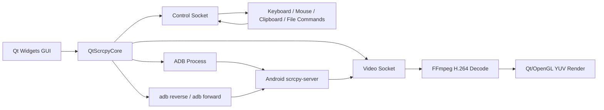

# QtScrcpy 项目调研报告

调研对象：[barry-ran/QtScrcpy](https://github.com/barry-ran/QtScrcpy)

调研日期：2026-05-08

## 1. 项目概览

QtScrcpy 是一个基于 scrcpy 技术路线的 Android 实时投屏与控制工具，主要目标是把 scrcpy 的命令行能力产品化为跨平台桌面 GUI。项目使用 Apache-2.0 协议，默认分支为 `dev`，主要语言为 C++，使用 Qt Widgets 构建桌面界面。

从项目定位看，QtScrcpy 并不是对 scrcpy 命令行程序的简单外壳封装，而是重新实现了一套 PC 端客户端：自行管理 ADB、设备连接、server 启动、socket 通信、视频解码、控制消息和 GUI 渲染。Android 端仍复用 scrcpy-server。

截至本次调研，QtScrcpy 最新正式版本为 `v3.3.3`，发布时间为 2025-11-06；项目仍有维护活动，但近期更新更多集中在 CI 和打包维护，核心功能演进节奏相对有限。

## 2. 技术架构路线

### 2.1 总体架构

QtScrcpy 采用典型的“桌面客户端 + Android server”架构：

项目代码主要分为两层：

- `QtScrcpy/`：桌面 GUI 层，包含主窗口、视频窗口、工具栏、系统托盘、配置、无线连接入口、录屏/截图入口和键位脚本 UI。
- `QtScrcpy/QtScrcpyCore/`：核心能力层，封装 ADB、设备管理、server 生命周期、视频流接收、FFmpeg 解码、录制、控制消息、文件传输等。

这种拆分使 QtScrcpy 具备一定的“客户端内核”形态，但 `QtScrcpyCore` 仍强依赖 Qt、FFmpeg 和本项目的事件模型，不能简单视为可直接复用的轻量 SDK。

### 2.2 设备连接与 server 启动流程

QtScrcpy 的启动链路与 scrcpy 原理一致，但由 C++/Qt 代码自行编排：

1. 通过 ADB 将 `scrcpy-server` 推送到 Android 设备，默认路径为 `/data/local/tmp/scrcpy-server.jar`。
2. 优先尝试 `adb reverse` 建立本机监听到设备端的反向通道。
3. 如果 `adb reverse` 失败，则回退到 `adb forward`。
4. 通过 `adb shell CLASSPATH=... app_process / com.genymobile.scrcpy.Server ...` 启动 Android 端 server。
5. 建立 video socket 与 control socket。
6. PC 端读取设备名、画面尺寸等元信息。
7. 视频流进入 demux/decode/render 流程，控制流进入键鼠、剪贴板、文件等消息流程。

这条链路中比较值得关注的是它的分阶段状态机设计：`push -> enable tunnel -> execute server -> connect sockets -> running`。这种结构适合把每一步失败原因暴露给产品层，而不是把投屏失败压缩成一个笼统错误。

### 2.3 视频处理路线

QtScrcpy 不直接调用外部 scrcpy 可执行文件，而是自行处理视频流：

- Android 端使用 scrcpy-server 通过 MediaCodec 编码 H.264。
- PC 端通过 socket 接收 H.264 原始流。
- 使用 FFmpeg/libavcodec 解码。
- 使用 Qt/OpenGL 进行 YUV 渲染。
- 支持跳过过期帧以降低延迟。
- 支持录屏，将视频包写入 MP4/MKV。

这种路线的优点是可控性强，可以在客户端内部做帧处理、录制、渲染策略和多窗口管理；缺点是实现和维护成本显著高于直接调用 scrcpy CLI。

### 2.4 控制消息路线

控制链路通过 control socket 将 PC 端事件发送给 Android server。QtScrcpy 支持：

- 鼠标点击、移动、滚轮。
- 键盘事件。
- Android 导航按键，如返回、主页、菜单、应用切换。
- 电源、音量、息屏/亮屏。
- 文本输入。
- 剪贴板请求、设置、粘贴。
- APK 安装和文件推送。
- 游戏键鼠映射脚本。

这说明 QtScrcpy 的核心不是“投屏”单点能力，而是围绕投屏会话建立了一套完整的远程交互通道。

### 2.5 构建与发布路线

项目使用 CMake 构建，CI 覆盖 Windows、macOS 和 Linux：

- Windows：Qt 5.15.2 + MSVC，产物为 zip。
- macOS：Qt 5.15.2 x64、Qt 6.5.3 arm64，产物为 dmg。
- Linux：Qt 5.15.2，产物为 AppImage。

项目会将 ADB、FFmpeg 动态库、scrcpy-server、sndcpy 脚本等依赖打包到发布产物中。这个策略降低了终端用户安装门槛，但也带来了依赖版本维护、平台签名、杀毒误报、包体增大和兼容性验证压力。

## 3. 功能亮点

### 3.1 GUI 化的 scrcpy 使用体验

QtScrcpy 把 scrcpy 复杂参数和连接流程转成 GUI：

- 设备列表刷新。
- 双击设备启动投屏。
- bitrate、分辨率、fps、方向锁等常用参数可视化配置。
- 录屏路径与格式配置。
- reverse/forward 连接策略选择。
- 日志面板展示 ADB 执行状态。

对于非命令行用户，这是它最核心的产品价值。

### 3.2 多设备与群控能力

项目内置多设备连接管理和 group controller。相比普通 scrcpy 单窗口模式，QtScrcpy 更偏向“多设备管理工具”：

- 可以同时连接多个 Android 设备。
- 每个设备有独立视频窗口。
- 支持群控，将操作广播到多台设备。

这类能力对测试机房、运营设备、手游辅助操作等场景更有吸引力。

### 3.3 无线连接辅助

QtScrcpy 提供 Wi-Fi 连接相关 UI：

- 获取设备 IP。
- 执行 `adb tcpip 5555`。
- 执行 `adb connect ip:port`。
- 保存 IP 和端口历史。
- 支持无线断开。

虽然它主要还是传统 `adb tcpip` 流程，但从产品交互角度看，已经把“USB 初始化后无线连接”的常见步骤串起来了。

### 3.4 游戏键鼠映射

QtScrcpy 支持 JSON 键位脚本，例如和平精英、第五人格、TikTok 等示例配置。它不仅是普通投屏工具，也明显面向游戏控制场景做了扩展：

- 鼠标移动映射。
- 按键映射。
- 触控点映射。
- 游戏脚本加载与切换。

这部分是普通 scrcpy GUI 外壳通常不会深入实现的能力。

### 3.5 文件、APK、剪贴板和音频补充能力

除投屏控制外，QtScrcpy 还补齐了常见桌面管理能力：

- 拖拽安装 APK。
- 拖拽文件到设备。
- 截图。
- 录屏。
- 剪贴板操作。
- sndcpy 音频转发入口。

这些能力使其更像完整 Android 桌面控制台，而不是单纯投屏窗口。

## 4. 风险与不足

### 4.1 维护响应存在不确定性

项目 stars 和 forks 很高，但 open issues 数量也很高。本次调研时 open issues 约 600+，近期 issue 中有不少没有回复。说明项目社区关注度强，但维护消化能力有限。

对依赖方而言，这意味着不能假设上游会及时解决 Android 新版本、macOS 新系统、ADB 行为变化或设备厂商兼容问题。

### 4.2 与上游 scrcpy 存在版本滞后

QtScrcpy 的 Android server 来自 scrcpy-server，但 release 节奏落后于 Genymobile/scrcpy。QtScrcpy `v3.3.3` release 说明中提到更新到 scrcpy-server `3.3.1`，而上游 scrcpy 已发布 `v3.3.4`。

这种滞后会带来几个问题：

- Android 新版本兼容修复无法第一时间获得。
- scrcpy 新参数和新协议不一定被 QtScrcpy 客户端适配。
- server 参数如果变化，QtScrcpy 自己的 C++ 启动参数构造需要同步维护。

### 4.3 直接复用成本高

虽然 `QtScrcpyCore` 看起来像独立核心库，但它不是一个轻量、跨技术栈友好的 SDK：

- 强依赖 Qt 对象模型、signal/slot、QProcess、QTcpSocket。
- 视频链路依赖 FFmpeg 和 Qt/OpenGL 渲染。
- 控制事件使用 Qt 的鼠标键盘事件结构。
- 构建链路依赖 CMake、平台 FFmpeg 库和 Qt 环境。

DroidDock 当前技术路线是 Tauri/Vue/Rust。如果直接引入 QtScrcpyCore，会造成桌面框架、运行时依赖、构建系统和包体结构的明显冲突。

### 4.4 无线连接路线偏旧

QtScrcpy 主要围绕 `adb tcpip 5555` 和 `adb connect ip:port` 做无线连接。这适合老流程，但对 Android 11+ 的 `adb pair` 无线调试体验支持不足。

DroidDock 如果要做现代 Android 设备管理，不能只照搬 QtScrcpy 的无线连接流程，需要同时支持：

- 传统 `adb tcpip`。
- Android 11+ `adb pair host:port code`。
- 配对端口和连接端口分离。
- 已配对设备的复连和失败诊断。

### 4.5 依赖内置打包带来维护压力

QtScrcpy 将 ADB、FFmpeg、scrcpy-server、sndcpy 等依赖打进发布包。这个方式对用户友好，但对维护者要求高：

- 需要持续维护每个平台的二进制依赖。
- FFmpeg ABI 和平台动态库路径容易出问题。
- macOS 需要关注签名、公证、权限提示和 Apple Silicon/x64 差异。
- Windows 需要关注 MSVC runtime、杀毒误报和 DLL 加载路径。
- Linux AppImage 需要处理系统库兼容性。

这对一个长期产品来说是持续成本，而不是一次性工程。

### 4.6 测试与质量保障透明度不足

项目有 GitHub Actions 构建，但从仓库结构看，自动化测试覆盖并不突出。对投屏控制类项目来说，真正高风险的是跨设备、跨 Android 版本、跨 ADB 版本、跨桌面系统的行为兼容，这类验证很难只靠编译 CI 兜住。

因此，如果借鉴 QtScrcpy 的实现，需要额外设计 DroidDock 自己的验证矩阵，而不能把上游实现视为充分验证过的稳定基础。

## 5. 对 DroidDock 的借鉴意义

### 5.1 可以借鉴的方向

#### 5.1.1 会话生命周期状态机

QtScrcpy 的启动链路清晰地拆成多个阶段。DroidDock 可以参考这种设计，把投屏会话状态表达为：

- 准备工具。
- 检查设备。
- 推送或确认 server。
- 建立 reverse/forward。
- 启动 scrcpy。
- 等待窗口或进程。
- 运行中。
- 停止中。
- 已失败。

这样有利于 UI 展示具体进度，也有利于日志和失败恢复。

#### 5.1.2 参数模型

QtScrcpy 的 `DeviceParams` / `ServerParams` 对投屏参数进行了集中建模。DroidDock 可以继续强化自己的参数层级：

- 全局默认参数。
- 设备级覆盖参数。
- 单次会话临时参数。
- 实际启动参数快照。

尤其要保留“会话启动时的参数快照”，避免用户后续修改默认值后，历史会话显示发生漂移。

#### 5.1.3 reverse 优先、forward 回退

QtScrcpy 的策略是优先 `adb reverse`，失败后自动回退 `adb forward`。DroidDock 可以借鉴这个策略，但应把失败原因和回退行为显式展示给用户，例如：

- `adb reverse` 不支持或失败。
- 已自动切换到 `adb forward`。
- 当前设备可能是无线连接或 ADB 环境异常。

这比简单显示“启动失败”更利于排障。

#### 5.1.4 无线连接的产品化流程

QtScrcpy 对 IP、端口历史、无线连接按钮做了产品化包装。DroidDock 可以在此基础上做更现代的版本：

- USB 设备页展示当前 WLAN IP。
- 传统无线连接：`adb tcpip` + `adb connect`。
- 现代无线调试：`adb pair` + `adb connect`。
- 配对地址、配对码、连接地址分开建模。
- 保存最近连接地址。
- 对常见错误提供指导，如端口错误、手机重启后无线调试失效、电脑和手机不在同一网络。

#### 5.1.5 多设备与群控的远期价值

DroidDock 当前如果以“设备连接和投屏会话管理”为核心，QtScrcpy 的多设备和群控可以作为后续高级能力参考：

- 多设备卡片并行运行状态。
- 批量停止会话。
- 多设备统一参数模板。
- 群控作为高级功能，而不是 MVP 必选项。

### 5.2 不建议借鉴的方向

#### 5.2.1 不建议引入 QtScrcpyCore

DroidDock 不应直接依赖 `QtScrcpyCore`。原因不是它没有价值，而是它和 DroidDock 的技术栈边界不匹配：

- DroidDock 是 Tauri/Vue/Rust。
- QtScrcpyCore 是 Qt/C++。
- 引入后会带来双桌面框架、双构建体系和复杂 native 依赖。
- 后续维护风险高于收益。

DroidDock 更适合继续走“Rust 管理工具链和进程，前端管理体验”的路线。

#### 5.2.2 不建议重写 scrcpy 客户端内核

QtScrcpy 自己处理 socket、FFmpeg decode、OpenGL render，这是高控制力路线，但工程复杂度很高。DroidDock 当前不应重写 scrcpy 客户端内核，除非未来产品目标明确变成“自研低延迟投屏引擎”。

短中期更合理的路线是：

- 复用官方 scrcpy 可执行文件。
- DroidDock 负责编排 ADB、配置、下载、启动、日志、会话状态、错误诊断。
- 等产品价值稳定后，再评估是否需要更底层的视频控制能力。

#### 5.2.3 不建议只支持传统无线连接

QtScrcpy 的无线连接体验可以参考，但 DroidDock 不应停留在 `adb tcpip 5555`。现代 Android 用户会更常遇到无线调试配对码流程，DroidDock 应将 `pair` 作为一等能力。

### 5.3 DroidDock 可落地的改进清单

结合 QtScrcpy 的经验，DroidDock 后续可以优先考虑以下方向：

1. 完善会话启动状态机，把工具检查、设备检查、参数生成、scrcpy 启动、失败原因拆开展示。
2. 在设备详情中强化有效参数展示，明确全局默认、设备覆盖、会话临时参数的来源。
3. 增加 reverse/forward 诊断信息，而不只是记录最终 scrcpy 命令。
4. 强化无线连接模块，覆盖 `adb pair`、`adb connect`、传统 `adb tcpip` 三条路径。
5. 保存无线连接历史，包括 pair host、connect host、端口和最近成功时间。
6. 将常见 ADB/scrcpy 错误转为结构化提示，例如多设备冲突、pair 不支持、端口拒绝、server 启动失败。
7. 远期再评估多设备批量操作和群控，不建议提前放进 MVP 主路径。

## 6. 综合判断

QtScrcpy 对 DroidDock 的最大价值不是代码复用，而是架构参照和产品边界参照。

它证明了 Android 投屏控制工具可以从单次命令启动，扩展成完整桌面设备管理体验：设备列表、参数配置、无线连接、投屏会话、文件操作、录屏截图、键鼠控制、多设备管理和日志诊断。

但 QtScrcpy 同时也暴露了高维护成本路线的风险：一旦自研客户端内核，就必须长期维护 ADB、scrcpy-server 协议、FFmpeg、平台打包和设备兼容性。DroidDock 当前更适合选择更轻的路线：以官方 scrcpy 为底层执行器，以 DroidDock 自身提供更好的安装、配置、设备管理、无线配对、会话编排和故障诊断体验。

因此，本报告建议 DroidDock：

- 借鉴 QtScrcpy 的功能组织和会话状态设计。
- 避免直接复用 QtScrcpyCore。
- 避免短期重写视频解码和渲染链路。
- 把重点放在“scrcpy 使用体验产品化”和“ADB 连接复杂度消化”上。
